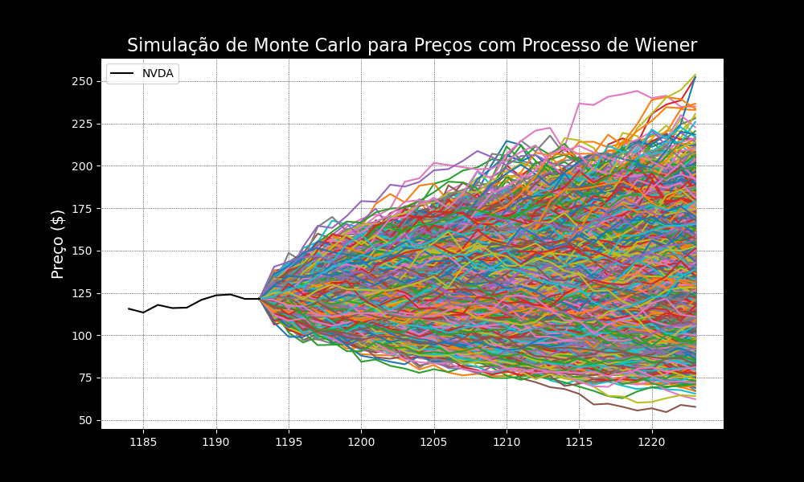

# Monte Carlo Aplicado a Finanças

Este repositório tem como objetivo demonstrar aplicações do método de **Monte Carlo** no ramo das finanças.  
Os arquivos aqui disponibilizados são parte da prática adquirida em meus estudos sobre o assunto.

## Sumário
1. [O que é o Método de Monte Carlo?](#o-que-é-o-método-de-monte-carlo)
2. [Monte Carlo com Movimento Browniano (Processo de Wiener)](#monte-carlo-com-movimento-browniano-processo-de-wiener)
3. [Tópicos Futuros](#tópicos-futuros)

## O que é o Método de Monte Carlo?

O método de **Monte Carlo** é uma técnica estatística utilizada para estimar o comportamento futuro de variáveis incertas, como preços de ativos financeiros.  
Ele envolve a simulação de várias trajetórias possíveis para essas variáveis, com base em distribuições de probabilidade, sendo amplamente utilizado para simular trajetórias futuras do preço de ativos financeiros com base em processos estocásticos e parâmetros previamente estimados.

# Monte Carlo com Movimento Browniano (Processo de Wiener)

Este exemplo aplica o **Processo de Wiener** (Movimento Browniano) para a simulação de trajetórias de preços de ativos.  
O movimento browniano é amplamente utilizado em finanças para modelar a evolução do preço de ativos ao longo do tempo, levando em conta volatilidade e retornos esperados.

[Previsão Preços - Movimento Browniano](Monte_Carlo_Previsao_Precos.ipynb)

## Tópicos Futuros
Temas que pretendo adicionar.

- Monte Carlo com Markov Chains (MCMC)

